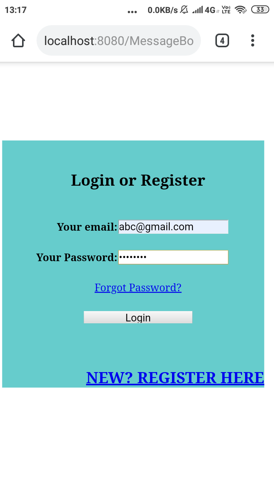
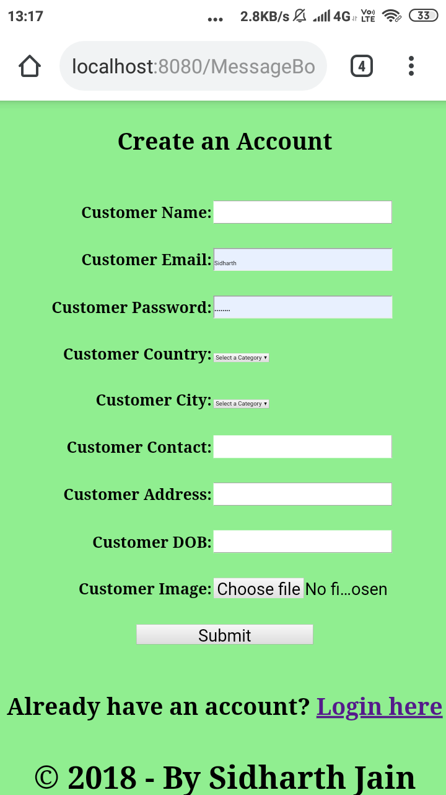
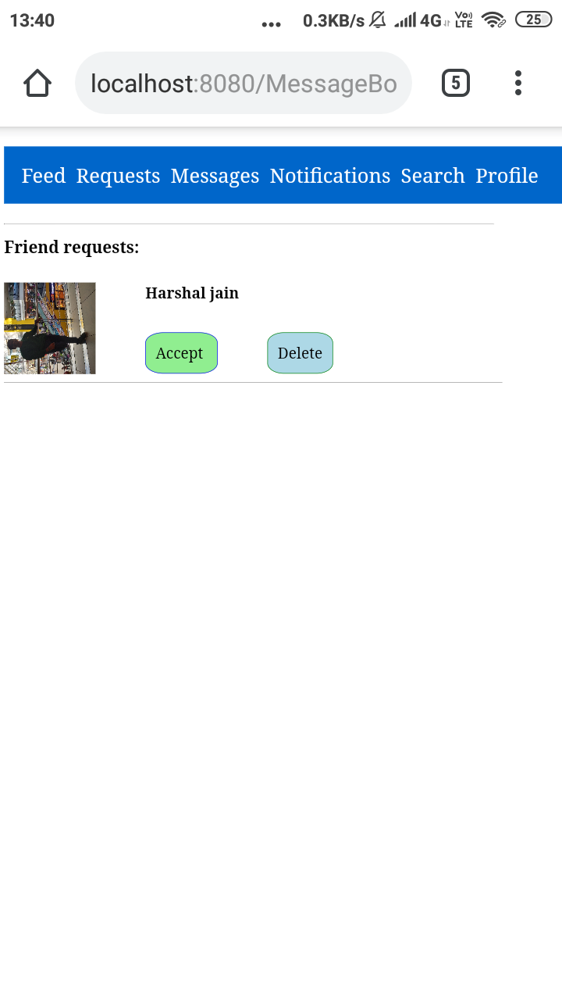
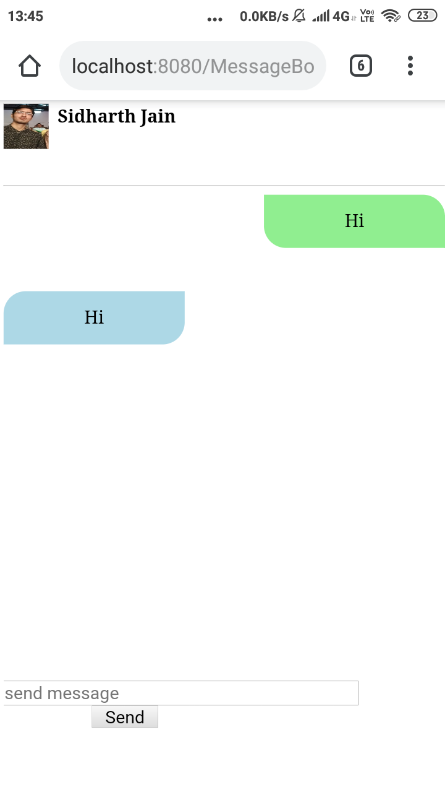
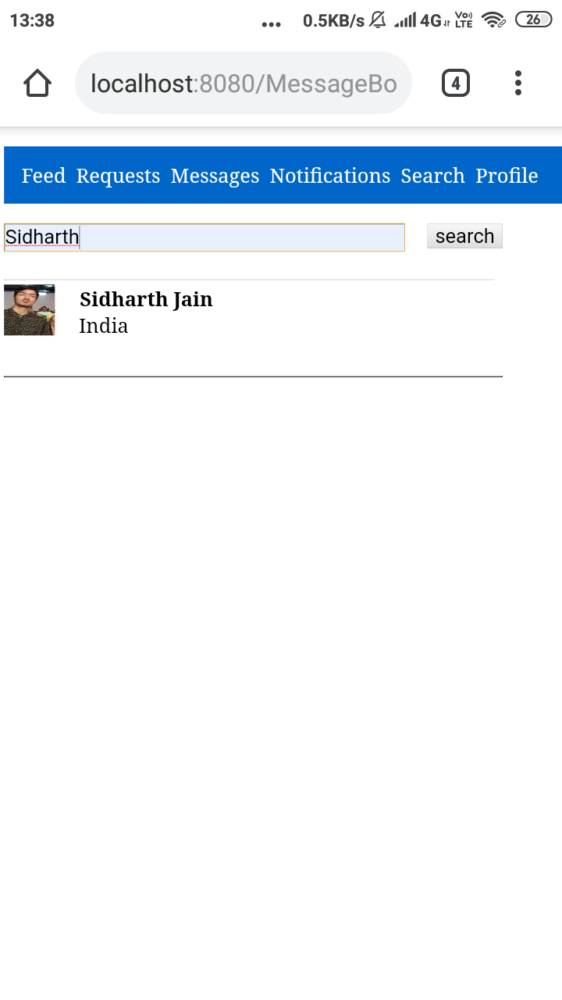
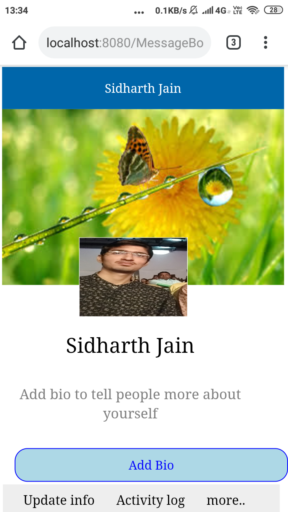

# ChatWebApp
My try to build a chat web application. 
This app is just to test myself if I can build something. I got myself into web development when i began learning to code. This app is completely built by me from scratch.

I did not concentrate on UI, as my main interest was to build something working.

<h3>Warning: This app is vulnerable and many vulnerabilities can be exploited and thus it can't be considered for production.</h3>

Languages used to build:
1. html
2. css
3. javascript
4. php
5. AJAX - to make some functionalities work asynchronously
6. MySQL database.

Usage:
1. git clone https://github.com/Sidharth99/MessengerWebApp.git. 
2. cd MessengerWebApp
3. basically there will be 3 files you need to change: create_dbs.php, create_tables.php, includes/db.php where you need to add database configurations like username, password.
4. start your server and open create_dbs.php in browser. It should show you database created successfully. 

5. open create_tables.php in browser and that will create tables. If that does not work make sure you have changed the required configurations correctly.
6. Now you are good to go.
7. Open customer_login.php and then register a user. <table><tr><td></td><td></td></tr></table>
8. Once you are loggedin, the interface might look like: <table><tr><td></td></tr></table>
9. You can navigate using the navigation bar.
* Feed --> contains all your network feed.<table><tr><td></td></tr></table>
* Requests --> contains all your friend requests.<table><tr><td></td><td></td></tr></table>
* Messages --> all your messages.<table><tr><td></td><td></td></tr></table>
* Notifications --> Didn't add that yet.
* Search --> Search someone.<table><tr><td></td></tr></table>
* profile --> That's your profile.<table><tr><td></td></tr></table>
10. Now you can chat with your friends, send friend request, view anyone's profile by searching and clicking on his/her name/image, Post feed, comment and like on feed.
